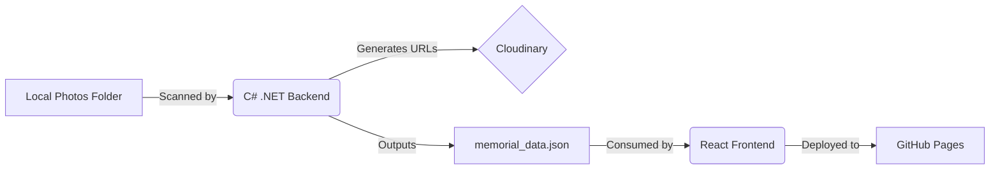

```markdown
# Memorial Tribute Platform

A full-stack static site generator designed to create a respectful, performant, and responsive digital memorial.

This project utilizes a **Hybrid Architecture**: A C# .NET Console Application serves as a custom "Headless CMS" to process media assets and generate data, which is then consumed by a React Frontend hosted on GitHub Pages.

## Key Features

* **Custom Content Generation:** A C# backend scans local directories, processes filenames, generates Cloudinary optimized URLs, and outputs a structured JSON payload.
* **Performance First:** React Frontend uses `lazy-loading`, Cloudinary `f_auto/q_auto` optimization, and responsive image sizing to ensure fast load times on mobile.
* **Cinema-Style UI:** Features an edge-to-edge immersive hero section and a mobile-responsive "Cinema Mode" for viewing memories.
* **Responsive Design:** Fully adaptive CSS Grid layout with a custom-built hamburger menu for mobile navigation.

## Tech Stack

### Frontend
* **Framework:** React 18
* **Styling:** CSS3 (Variables, Flexbox, Grid, Animations)
* **Hosting:** GitHub Pages via `gh-pages`
* **State Management:** React Hooks (`useState`, `useEffect`)

### Backend (Data Generator)
* **Language:** C# (.NET 8.0)
* **Principles:** Dependency Injection (DI), Interface Segregation, SOLID.
* **Services:** `System.IO` for file scanning, `System.Text.Json` for serialization.
* **Cloud Integration:** Cloudinary (for Asset Management).

---

## Architecture



## Setup & Installation

### Prerequisites

* Node.js & npm
* .NET SDK (6.0 or higher)
* Cloudinary Account

### 1. Backend Configuration (Data Generation)

Navigate to the `MemorialBackend` folder.

1. Place your photos in the `photos_to_upload` directory.
2. Update `Program.cs` with your Cloudinary Cloud Name.
3. Run the generator:
```bash
cd MemorialBackend
dotnet run

```


4. This generates a `memorial_data.json` file. Copy this file to `memorial-site/public/`.

### 2. Frontend Setup

Navigate to the `memorial-site` folder.

1. Install dependencies:
```bash
cd memorial-site
npm install

```


2. Start the local development server:
```bash
npm start

```


3. Open `http://localhost:3000` to view the site.

---

## Deployment

This project uses `gh-pages` for deployment.

1. Ensure `memorial_data.json` and `hero-image.jpg` are in the `public` folder.
2. Run the deploy script:
```bash
npm run deploy

```


3. The site will be live at `https://[USERNAME].github.io/[REPO-NAME]`.

---

## Project Structure

```bash
/
├── MemorialBackend/          # C# Console Application
│   ├── Services/             # Business Logic & Scanners
│   ├── Models/               # Data Structures
│   ├── Interfaces/           # DI Contracts
│   └── Program.cs            # Entry Point
│
└── memorial-site/            # React Application
    ├── public/               # Static Assets (JSON, Images)
    ├── src/
    │   ├── App.js            # Main Component Logic
    │   └── App.css           # Global Styles & Theme
    └── package.json          # Dependency Config

```

## License

This project is open source and available under the [MIT License](https://www.google.com/search?q=LICENSE).

```